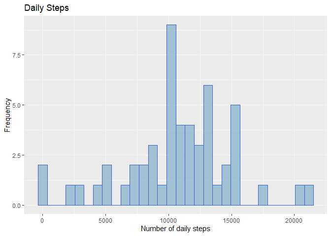
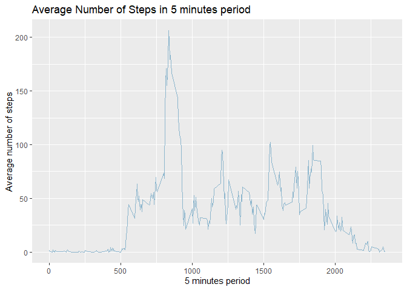
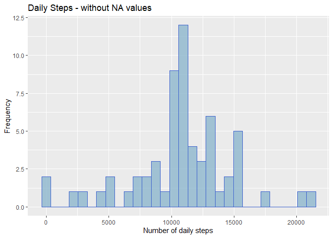
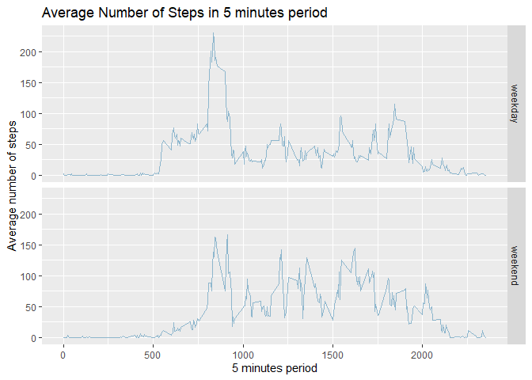

## Loading and preprocessing the data

First step is to unzip and load the data into the "steps" dataframe:


```r
steps <- read.csv(unzip("activity.zip"),header = TRUE)
```

After that, the "date" variable must be converted to POSIX class. In order to do this, de *dplyr* package must be loaded.

```r
library(dplyr)
steps <- steps %>% mutate(date = strptime(date,"%Y-%m-%d"))
```

These steps leaves us with the dataframe ready to work.

About the environment, to avoid scientific notation on number printing, the *scipen* parameter is modified, and *digits* parameter set to 2, for two decimal places.

```r
options("scipen"=100, digits = 2)
```


## What is mean total number of steps taken per day?
In order to calculate this, the *group_by* function of dplyr was used, and *NAs* were also filtered.  


```r
steps_daily_total <- steps %>% 
  filter( !is.na(steps)) %>% 
  group_by(date) %>% 
  summarize(sum(steps))

names(steps_daily_total)[2] <- "Total_steps"
```

### Historgram  

For plotting the histogram, ggplot2 was used.  


```r
library(ggplot2)

steps_daily_total %>%
  ggplot( aes(x=Total_steps )) +
    geom_histogram( fill="lightskyblue3", color="royalblue3", alpha=0.8) + 
    labs(title = "Daily Steps") + labs(x = "Number of daily steps", y = "Frequency")
```

<!-- -->

### Mean and Median  
By using the previously calculated *steps_dayly_total*, mean and median can be also calculated.

**Mean** for the total number of steps:  

```r
mean(steps_daily_total$Total_steps)
```

```
## [1] 10766
```

**Median** for the total number of steps:  

```r
median(steps_daily_total$Total_steps)
```

```
## [1] 10765
```


*** 


## What is the average daily activity pattern?
In order to plot this information, again the *group_by* function of *dplyr* package is used. This time the group_by is applied to *interval* variable.  

```r
steps_daily_pattern <- steps %>% 
  filter( !is.na(steps)) %>% 
  group_by(interval) %>%
  summarize(mean(steps))

names(steps_daily_pattern)[2] <- "Avg_nbr_steps"
```

### Time series plot  

```r
steps_daily_pattern %>%
  ggplot(aes(x=interval, y=Avg_nbr_steps)) +
  geom_line( color="lightskyblue3") + 
  labs(title = "Average Number of Steps in 5 minutes period") + 
  labs(x = "5 minutes period", y = "Average number of steps")
```

<!-- -->
<br>
<br>

### 5-minute interval with the maximum number of steps  

The result for this question is:  

```r
subset(steps_daily_pattern,Avg_nbr_steps == max(steps_daily_pattern$Avg_nbr_steps))$interval
```

```
## [1] 835
```


## Imputing missing values

The total number of missing values in the dataset are:  

```r
sum(is.na(steps$steps))
```

```
## [1] 2304
```

In order to fill up those NA values, the strategy will be to calculate the average number of steps for each 5-minute interval. So, for example, if the average number of steps for interval "625" is 47.1, then 47.1 is the value that will be used on all NAs that appears on intervals "625".  

The detailed steps are:  

1. In a new dataframe, store the result of the *left_join* between original dataset and calculated *steps_daily_pattern*

```r
steps_NAfree <- left_join(steps,steps_daily_pattern, by="interval")
head(steps_NAfree)
```

```
##   steps       date interval Avg_nbr_steps
## 1    NA 2012-10-01        0         1.717
## 2    NA 2012-10-01        5         0.340
## 3    NA 2012-10-01       10         0.132
## 4    NA 2012-10-01       15         0.151
## 5    NA 2012-10-01       20         0.075
## 6    NA 2012-10-01       25         2.094
```

2. For each **NA** value, change it to its corresponding *Avg_nbr_steps*

```r
steps_NAfree$steps <- ifelse(is.na(steps_NAfree$steps), steps_NAfree$Avg_nbr_steps, steps_NAfree$steps)
head(steps_NAfree)
```

```
##   steps       date interval Avg_nbr_steps
## 1 1.717 2012-10-01        0         1.717
## 2 0.340 2012-10-01        5         0.340
## 3 0.132 2012-10-01       10         0.132
## 4 0.151 2012-10-01       15         0.151
## 5 0.075 2012-10-01       20         0.075
## 6 2.094 2012-10-01       25         2.094
```

3. Remove last variable

```r
steps_NAfree <-  select(steps_NAfree, -c(Avg_nbr_steps))
head(steps_NAfree)
```

```
##   steps       date interval
## 1 1.717 2012-10-01        0
## 2 0.340 2012-10-01        5
## 3 0.132 2012-10-01       10
## 4 0.151 2012-10-01       15
## 5 0.075 2012-10-01       20
## 6 2.094 2012-10-01       25
```

### Histogram  


```r
steps_daily_total_NAfree <- steps_NAfree %>% 
  group_by(date) %>%
  summarize(sum(steps))

names(steps_daily_total_NAfree)[2] <- "Total_steps"

steps_daily_total_NAfree %>%
  ggplot( aes(x=Total_steps )) +
  geom_histogram( fill="lightskyblue3", color="royalblue3", alpha=0.8) + 
  labs(title = "Daily Steps - without NA values") + 
  labs(x = "Number of daily steps", y = "Frequency")
```

<!-- -->

### Mean and Median  
By using the previously calculated *steps_daily_total_NAfree*, mean and median can be also calculated.

**Mean** for the total number of steps:  

```r
mean(steps_daily_total_NAfree$Total_steps)
```

```
## [1] 10766
```

**Median** for the total number of steps:  

```r
median(steps_daily_total_NAfree$Total_steps)
```

```
## [1] 10766
```

Not much difference is seen. Mean and Median stays relatively the same. And the histogram peak moved slightly to the right.

## Are there differences in activity patterns between weekdays and weekends?

To answer this question, as stated in the lecture of the assignment, a new factor variable is created, stating whether a date belongs to a weekday or to weekend. After that, a summary is created with the average steps for each 5-minutes period and considering also the new factor variable. Lastly the plot is printed.

### Step 1, creation of factor variable  


```r
steps_NAfree$weekday <- weekdays(steps_NAfree$date)
steps_NAfree$weekday <- ifelse(steps_NAfree$weekday %in% c("sábado","domingo"),"weekend","weekday")
steps_NAfree$weekday <- as.factor(steps_NAfree$weekday)
```

### Step 2, creation of summary


```r
steps_daily_pattern_NAFree <- steps_NAfree %>% 
  group_by(interval,weekday) %>%
  summarize(mean(steps))

names(steps_daily_pattern_NAFree)[3] <- "Avg_nbr_steps"
```

### Step 3, plot


```r
steps_daily_pattern_NAFree %>%
  ggplot(aes(x=interval, y=Avg_nbr_steps)) +
  geom_line( color="lightskyblue3") + 
  labs(title = "Average Number of Steps in 5 minutes period") + 
  labs(x = "5 minutes period", y = "Average number of steps") + 
  facet_grid(weekday ~ .)
```

<!-- -->

Thanks.

